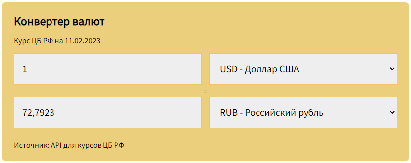

# Конвертер валют на React.js

Инструмент позволает рассчитать соотношения актуальных курсов валют. Актуальные данные загружаются с помощью доступного API, предоставляющего актуальную информацию о курсах ЦБ РФ.

[Демо](https://mchlv.ru/projects/currency-converter/)

